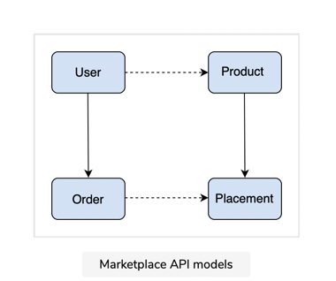

# Marketplace API

The marketplace application is a platform for authenticated users to view and
order products. The API will be integrated within this
application and used for data interchange between different application models.

This application consists of four models:

* The User model represents the users who view products and place orders.
* The Product model represents the products that are available on the platform.
* The Order model allows the users to place their orders.
* The Placement model is used to manage multiple orders.

